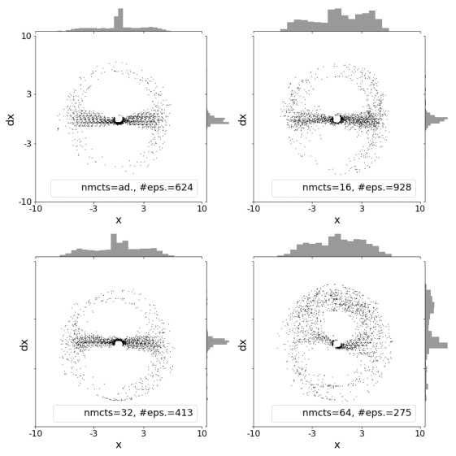
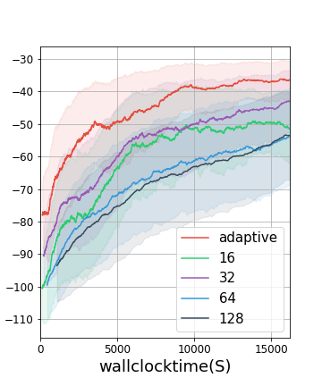

# Adaptive MCTS modifications in AlphaZero algorithm for single player, deterministic environments
AlphaZero algorithm modified to be compatible with single-player deterministic environments with adaptive return normalization in Monte Carlo tree search (MCTS) and optionally adaptive root return variance based MCTS iterations.

## Requirements
Code runs with Tensorflow 1.5, requirements listed in requirements.txt

## Tutorial
- Training scripts are assumed to be specified in json format in /hypes folder.
- Training can be run in parallel with loop_hyper_iters.py script.

example how to run on racecar problem:
python loop_hyper_iters.py --environment 'hypes' --base_json hypes/alphago_racecar.json --loop_json hypes/loop_config.json --train_file train_pybullet.py --outdir /out/path/ --thread_count 3

In loop_json hyperparameters to be used in grid search can be optimized.
In base_json all the rest of hyperparamers can be specified.

## Result visualizations
Results visualization tools can be found in the notebooks folder. 

Examples of visualization for pybullet's 'Racecar-v0' environment. MCTS iterations is varied N={16,32,64,128}, 'adaptive' denotes adaptive MCTS iterations based on root return variance:
- policy and value network predictions - 
    changes in policy network prediction entropy and value network prediction during fixed training time and state space grid:

- state space exploration - visualization of visited state space points in last 100 episodes of training

- episodic rewards

## References
AlphaZero implementation is based on https://github.com/tmoer/alphazero_singleplayer.
@tmoer
